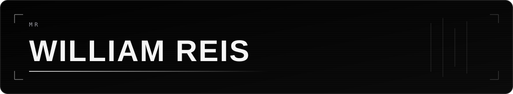
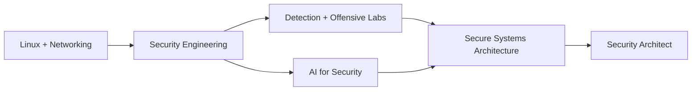

<div align="center">



<br />

[](#)
[](#)
[](#)
[](#)

### Founder-minded engineer building secure products, intelligent automation and real-world systems.

I connect **software engineering, cybersecurity, artificial intelligence, product and growth** to transform complex problems into systems that are useful, measurable and built to evolve.

`build → observe → test → protect → improve`

</div>

---

## `> mission_control`

```text
ROLE        Information Systems student · Software builder · Security practitioner
DIRECTION   Security Engineering → Security Architecture
BUILDING    SYNX products · security tooling · AI agents · operational platforms
APPROACH    Product thinking + engineering discipline + attacker mindset
STATUS      Always building. Always learning. Always shipping.
```

<table>
<tr>
<td width="33%" valign="top">

### `01 // Security`

- Linux and isolated labs
- Reconnaissance and OSINT
- Web and API security
- Detection and observability
- Secure architecture

</td>
<td width="33%" valign="top">

### `02 // AI Systems`

- LLM applications and agents
- RAG and vector memory
- Workflow automation
- Decision support systems
- AI applied to operations

</td>
<td width="33%" valign="top">

### `03 // Products`

- SaaS and internal platforms
- APIs and distributed services
- Dashboards and analytics
- Conversion-oriented interfaces
- From idea to deployment

</td>
</tr>
</table>

---

## `> featured_systems`

<table>
<tr>
<td width="50%" valign="top">

### [Recon-IP](https://github.com/Xwiuu/Recon-IP)

**OSINT reconnaissance engine** built around a terminal-first workflow, network intelligence and multi-format reporting.

`Bash` `Linux` `OSINT` `Network Security`

</td>
<td width="50%" valign="top">

### [CryptoSec Lab](https://github.com/Xwiuu/cryptosec-lab)

**Web3 security and audit laboratory** with vulnerable contracts, mitigations, local attack simulations and static analysis.

`Rust` `Solidity` `Foundry` `Next.js`

</td>
</tr>
<tr>
<td width="50%" valign="top">

### [GhostMirror](https://github.com/Xwiuu/GhostMirror)

**Authorized security intelligence platform** for reconnaissance, web/API analysis, vulnerability context and structured reporting.

`Python` `Rust` `Docker` `Security Intelligence`

</td>
<td width="50%" valign="top">

### [Agents-Trafego](https://github.com/Xwiuu/Agents-Trafego)

**Multi-agent AI system** for paid-media operations, auditability, API orchestration and performance decision support.

`Python` `FastAPI` `Next.js` `LangGraph`

</td>
</tr>
<tr>
<td width="50%" valign="top">

### [Sentinel God Eye](https://github.com/Xwiuu/Sentinel-God-Eye)

**Security operations and observability project** focused on telemetry, detection, threat scoring and response workflows.

`Go` `Python` `Java` `Vue`

</td>
<td width="50%" valign="top">

### [Art Scroll](https://github.com/Xwiuu/Art-Scroll)

**Interactive digital experience** that represents my product, interface and creative engineering side.

`Frontend` `Motion` `UX` `Digital Experience`

</td>
</tr>
</table>

> Some systems are active laboratories or evolving product builds. Repositories are improved continuously as architecture, documentation and testing mature.

---

## `> technology_matrix`

<div align="center">

### Core engineering


### Data, infrastructure and delivery


### Security and research environment


</div>

<table>
<tr>
<td width="50%" valign="top">

### Production focus

`Python` · `TypeScript` · `React / Next.js` · `Vue` · `Node.js` · `Go` · `PostgreSQL` · `Redis` · `Docker` · `Linux`

</td>
<td width="50%" valign="top">

### Active exploration

`Security Engineering` · `Networking` · `Rust` · `Solidity` · `Java` · `LLM Systems` · `Detection Engineering` · `Cloud Security`

</td>
</tr>
</table>

---

## `> github_telemetry`

<div align="center">


</div>

---

## `> current_trajectory`



- Deepening Linux, networking and system administration fundamentals
- Building tools that prove practical security and engineering ability
- Studying LLMs, agents, RAG and AI infrastructure
- Turning labs into documented, testable and useful open-source projects
- Developing SYNX as a long-term software and product operation

---

## `> engineering_principles`

> Security is not an extra layer. It is a design constraint.  
> Interfaces are not decoration. They guide behavior.  
> Code is not the goal. Reliable systems are.  
> Technology matters only when it solves a real problem.

---

<div align="center">

### Build systems. Understand attacks. Protect what matters.

[](https://github.com/Xwiuu/portfolio)
[](https://github.com/Xwiuu?tab=repositories)

<br />

<sub>Designed as a living engineering profile — updated as projects, studies and systems evolve.</sub>

</div>
